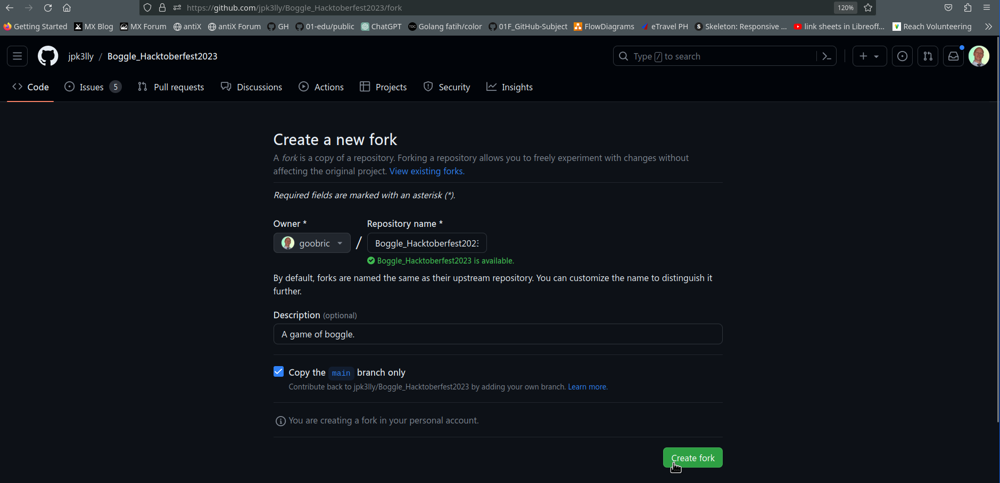
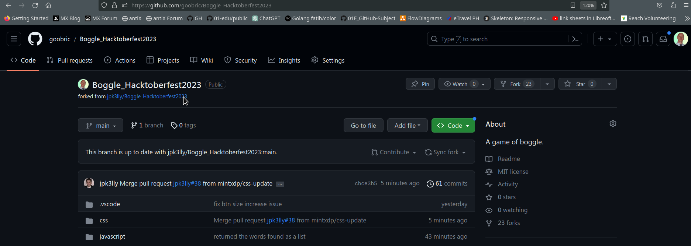
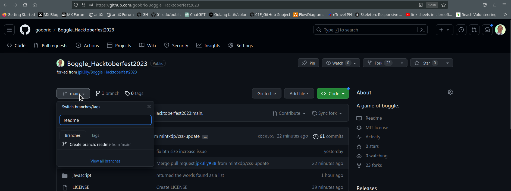
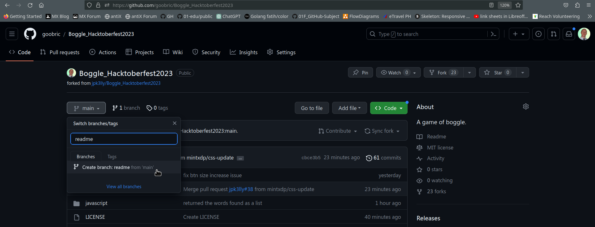
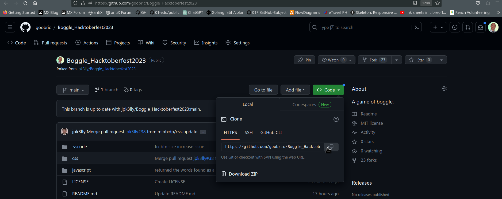
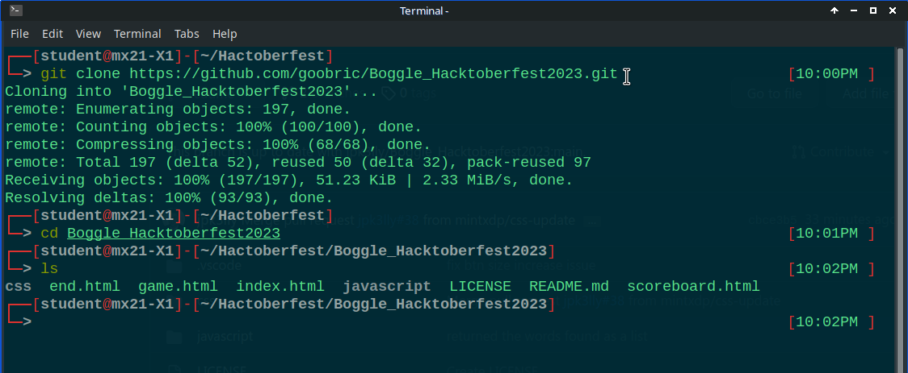
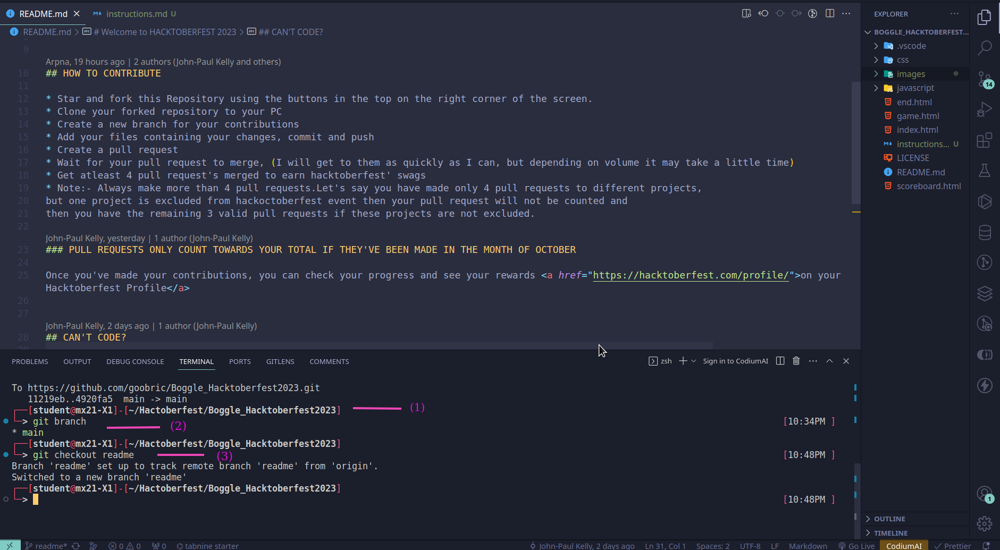

## Here are instructions on how to Fork, Clone, New Branch, Make Changes, Pull Request.

- [Fork](#fork)
- [New Branch](#new-branch)
- [Clone](#clone)
- [Make Changes](#make-changes)
- [Pull Request](#pull-request)

### Fork

'forking' is a term used in github to copy a repository from a project into your github account.

1. Click on the Fork button in the top right of the page, under the main title.

   

1. This will open a new window with your github account followed by the repository you are copying. Click the green Create fork button to copy this repository into your github account.
   

1. A window will open with your github account showing the repository you have just copied. Under the title of the repository, it will state 'forked from' with the name of the project owner, and the name of the repository.
   

### New Branch

github uses the Tree as a visual analogy of file management, and file changes.

1. Making a 'new branch' means copying all the files and folders from the main repository.

1. In your github account, with the 'forked' (copied) repository, click the 'main' button underneath the repository title.
   
   Give the new branch a descriptive name

1. **IMPORTANT:** next click on 'Create branch:(name) from main'
   

### Clone

'cloning' is a term used in github to copy a repository to your computer, creating a copy of the folders and files on the hard drive of your computer.

1. Click the green Code button a dropdown menu will appear. Click on the icon with the two squares next to the url to copy it.
   

1. A green check/tick mark will appear and a button with Copied. This copied url link will be needed to clone the repository to the computer.
   

1. Install Git (Version Control System) on your computer via this link [Git download](https://git-scm.com/download)

   - Git is needed to store and track any changes made to the downloaded repository, that is on the computer.
   - Git is used to 'push' any changes made to the downloaded repository back to github.

1. Open a terminal on your computer:

   - Apple Mac: click on Spotlight search and type the word terminal
   - Windows: install Git Bash and open the program
   - Linux: press the keyboard combination Ctrl+Alt+T

1. Navigate to the folder on your computer where you want to copy the github repository. Type 'git clone' and paste the repository url; then press enter on the keyboard.
   
   Open the folder that has just been created, the contents of the repository will be shown.

### Make Changes

To make changes to the downloaded repository, it is best to use a Code Editor. Use your favorite editor. Or if you don't have a code editor, here are some examples:

- [VSCode](https://code.visualstudio.com/)
- [Bluefish](https://bluefish.openoffice.nl)
- [Notepad++](https://notpad-plus.org)

1. Using your code editor, open the folder where the repository was copied to.

- Make sure that you are editing the new-branch that was created
- If your code editor supports an integrated terminal, open the terminal within your editor
- The terminal shows the current working directory (1)

1. **IMPORTANT:** Check which 'branch' is active by typing 'git branch' (2)

- current branch is 'main'

1. Change to the new-branch name by typing 'git checkout "new-branch-name" '

- terminal messages states 'Switched to a new branch "new-branch-name" (3)
  

1. Make meaningful changes to the file(s) and folders

1. **IMPORTANT:** Save the changes made
   1. use the 'git add' command with the name of the file
   2. use the 'git commit' command with a message in quotation marks, to stage the changes locally
   3. use the 'git push' command to push the changes to the repository stored on GitHub
      

### Pull Request

A 'pull request' is the way of asking the owner of the original repository that you have made changes to their project.

If the owner agrees that the changes improves the their project, they will 'merge' the changes you have to their repository.

- go to the origin repository where you 'forked' the project
- click on the green button 'Compare & pull request'
  

A new window will appear to 'Open a pull request'

- write a polite respectful message to the owner of the original repository outlining the changes you have made and how this might improve the project
- click on the green button 'Create pull request'
- wait for the owner of the project to acknowledge the pull request and respond.
  
